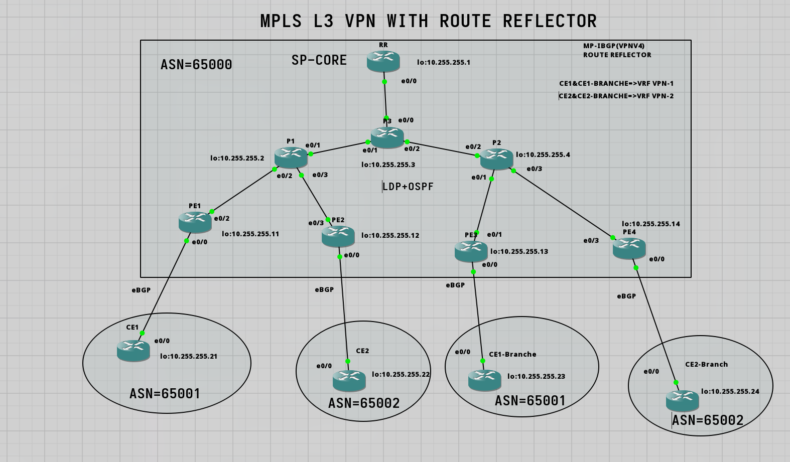

# 🚀 MPLS L3 VPN with BGP Route Reflector — Automation

A production-style **MPLS L3 VPN lab** built with **BGP Route Reflector architecture, LDP, OSPF, VRFs, VPNv4, and Python network automation**.

The lab focuses on building a scalable Service Provider network and solving a real-world **AS-PATH loop-prevention problem** when the same customer AS is used at multiple sites.

---

## 📌 Project Overview

This project simulates a Service Provider MPLS L3 VPN network providing isolated connectivity between multiple customer sites.

The topology contains:

- **11 routers**
- **3 P routers** forming the MPLS core
- **4 PE routers** connecting customers to the provider
- **4 CE routers** representing customer sites
- **1 BGP Route Reflector**

## 🌐 Network Topology



> 📌 Make sure your topology image is located at `images/mpls-l3vpn-topology.png`.

---

# 🎯 What I Built

## Core Infrastructure

- ✅ **BGP Route Reflector** for scalable iBGP
- ✅ Eliminated the need for a full-mesh iBGP configuration
- ✅ **3 P routers** forming the MPLS backbone
- ✅ **4 PE routers** serving multiple customers
- ✅ **4 CE routers** representing customer sites
- ✅ Complete VPN isolation between Customer 1 and Customer 2

---

# 🛠️ Technologies Implemented

| Technology | Purpose |
|---|---|
| **MPLS** | Label-based forwarding across the provider core |
| **LDP** | Automatic label distribution in the MPLS core |
| **BGP** | Customer route exchange |
| **MP-BGP VPNv4** | Distribution of VPN routes between PE routers |
| **Route Reflector** | Scalable iBGP route distribution |
| **VRF** | Customer routing-table isolation |
| **RD** | Makes overlapping customer prefixes unique |
| **RT** | Controls VPN route import/export |
| **OSPF** | IGP and provider infrastructure reachability |
| **Python** | Network configuration automation |
| **Telnetlib** | Automated router configuration |

---

# 🤖 Network Automation

With **11 routers** in the topology, manually configuring every router would be repetitive, time-consuming, and error-prone.

The most repetitive tasks were:

- Interface configuration
- IP addressing
- Subnet masks
- OSPF configuration

These tasks were automated using **Python and Telnetlib**.

## Automated Tasks

### Step 1 — IP Addressing

Python was used to automatically configure:

- Interface IP addresses
- Subnet masks
- Interface activation

### Step 2 — OSPF Configuration

The automation script also configured:

- OSPF process
- Router IDs
- OSPF networks
- Area assignments

## Automation Workflow

```text
Python Script
     │
     ▼
Connect to Routers
     │
     ▼
Configure Interfaces
     │
     ▼
Configure IP Addresses
     │
     ▼
Configure OSPF
     │
     ▼
Verify Connectivity
